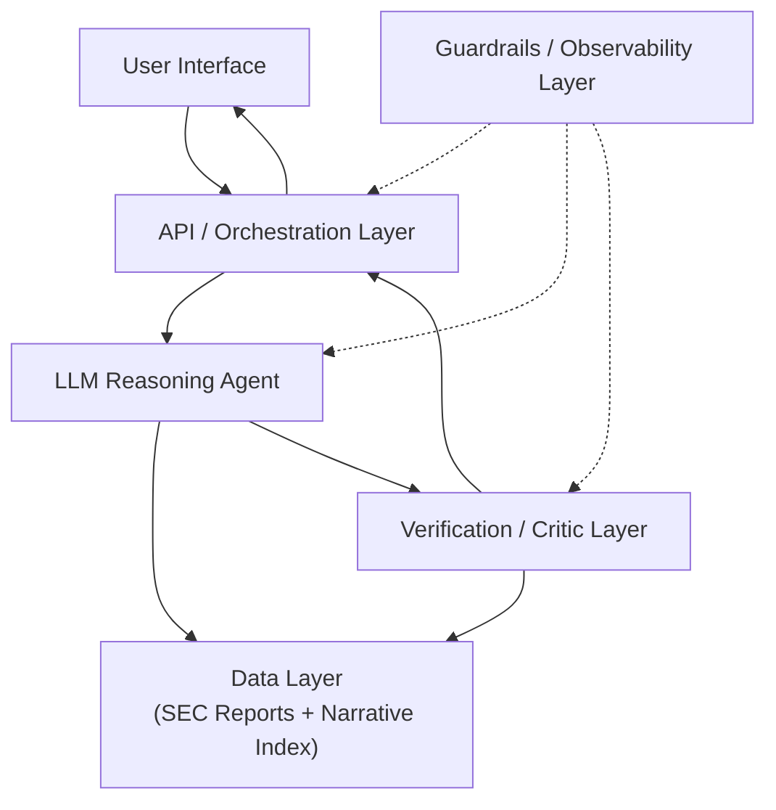
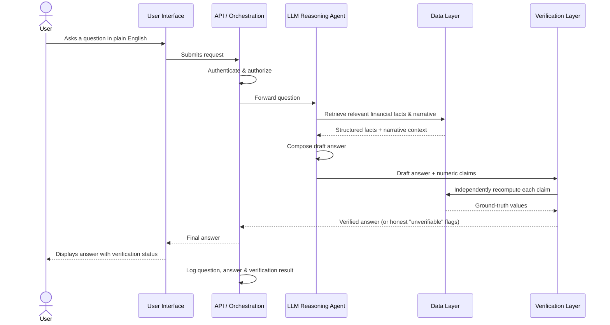
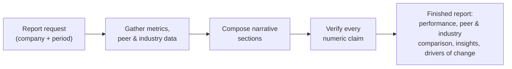

# Architecture

This document describes the system at a high level: what each part of the system is responsible for, and how a question flows through it. It intentionally stops above the level of specific technologies, services, or internal implementation — the goal is to convey the design, not the deployment.

## High-Level Diagram

## Request Flow — Answering a Question

The diagram above shows the components; this shows how a single question actually moves through them, step by step, before an answer ever reaches the screen.

Note the shape of this flow: the reasoning agent never talks back to the user directly, and the verification layer never trusts the agent's own retrieval — it goes back to the data layer itself before anything is confirmed.

## Report Generation Flow

Automated company reports follow the same trust model, applied across several metrics and comparisons at once rather than a single question.

## Component Descriptions

### User Interface
The surface a person interacts with — asking questions in natural language, browsing generated company reports, and exploring interactive visualizations with drill-down into the data points behind a chart. Its job is to present verified results clearly and let a user go from a high-level number down to the underlying detail without leaving the flow.

### API / Orchestration Layer
The entry point that receives a request, authenticates and authorizes it, routes it to the reasoning agent, and returns a response once it has cleared verification. This layer also enforces role-based access — which users can see which data and administrative functions — and is where every request and response is captured for the audit trail.

### LLM Reasoning Agent
The component that interprets a natural-language question, decides what information it needs, and retrieves that information from the data layer rather than generating it from memory. It composes an answer by reasoning over structured facts and relevant narrative context, but it does not perform arithmetic on its own or state a number without sourcing it from the data layer.

### Verification / Critic Layer
A separate, deterministic check that sits between the agent's draft answer and the user. For every numeric claim in a draft, this layer independently recomputes the figure from source data and confirms it matches what the agent stated. Claims that can't be confirmed are surfaced honestly as unverified rather than silently passed through or dropped. This layer is what turns "an LLM's best guess" into "an answer with a checked provenance."

### Data Layer (SEC Reports + Narrative Index)
Two complementary stores. A structured store holds normalized, per-company financial facts extracted from SEC Annual and Quarterly Reports — this is the single source of truth for any number the system states. A narrative index holds the report's written sections (management discussion, footnotes, disclosures) used for retrieval-augmented context — it informs qualitative "why" explanations, and is never the source of a numeric claim. Retrieval against this layer is always scoped to the company in question before any ranking happens.

### Guardrails / Observability Layer
A cross-cutting layer that monitors and constrains the system's behavior: keeping the agent within its intended scope, screening for unsafe or sensitive content, and providing tracing/evaluation of system behavior over time so quality and safety issues can be caught and diagnosed rather than discovered by users.

## Design Principles

- **The reasoning layer never does arithmetic.** Every number stated to a user is sourced from the data layer and checked by the verification layer — not calculated or estimated by the language model.
- **Narrative retrieval and numeric facts are kept separate.** Retrieval-augmented generation informs explanation and context; it is never the source of a number a user can act on.
- **Verification happens fresh, every time.** The verification layer independently recomputes ground truth rather than trusting an earlier step in the same request.
- **Failures are visible, not silent.** When something can't be verified or data is missing, the system says so rather than presenting a guess with false confidence.
