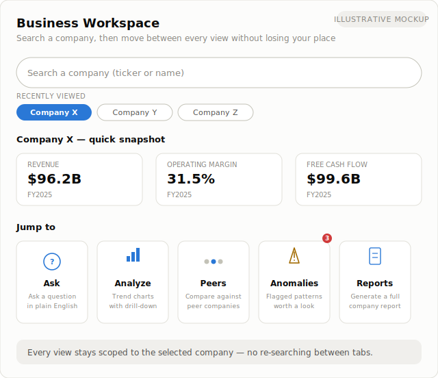
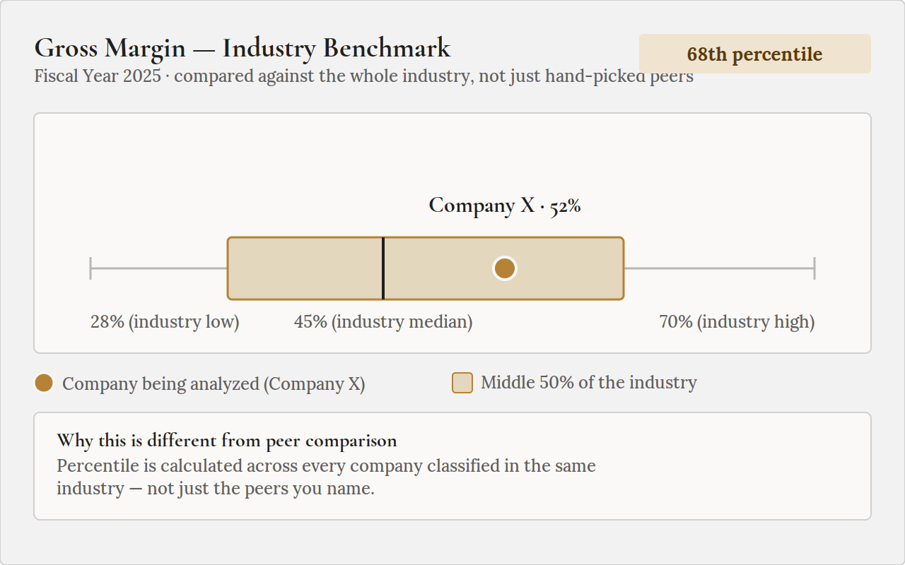
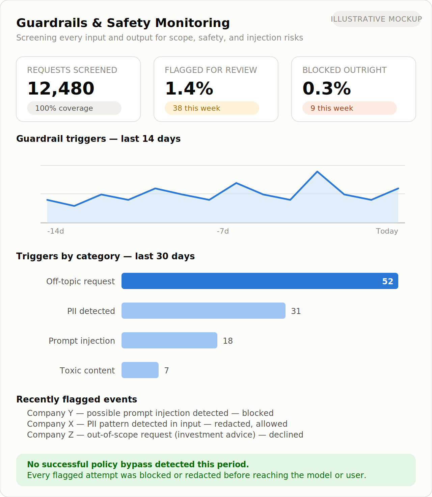
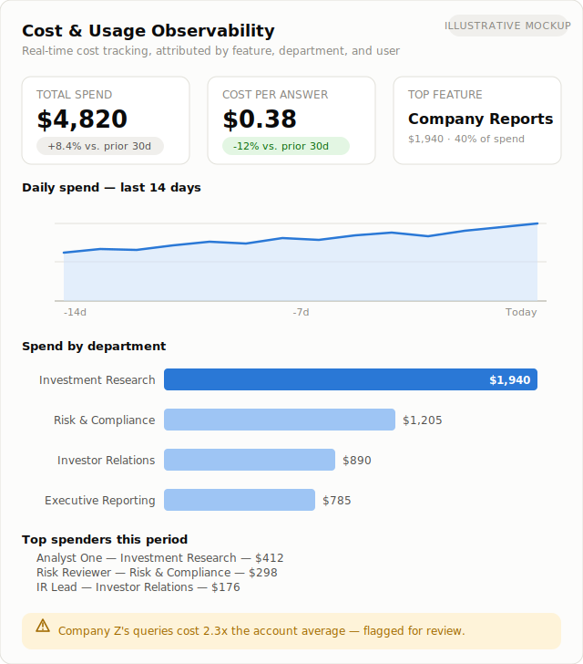
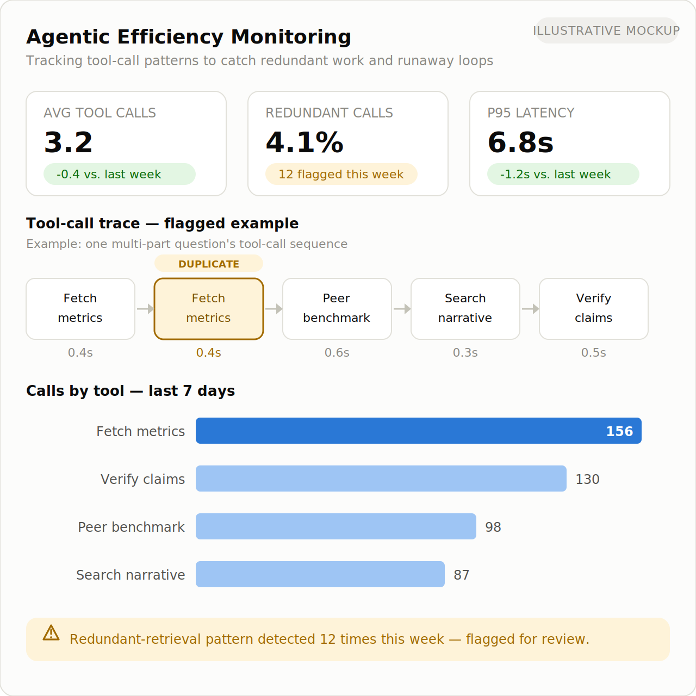
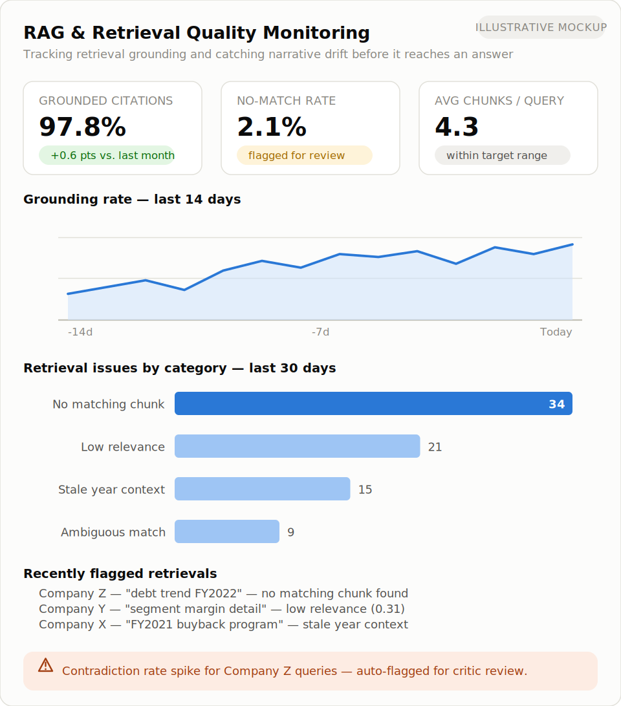

# Lectify Analytics

## What this is

Lectify Analytics is an agentic AI system for finance analysts, investors, and researchers who need fast, trustworthy answers grounded in public companies' SEC Annual Reports and Quarterly Reports. Instead of manually digging through those reports yourself, or hoping a chatbot's summary of a PDF is accurate, you ask a question in plain English and get a grounded answer — backed by structured financial data, cross-checked before it's shown to you, and logged for auditability.

It's built for the moments where "probably right" isn't good enough: due diligence, investment research, and financial analysis workflows where a wrong number is worse than no answer.

## Why it's different

Generic AI chat tools built directly on document text retrieve a passage and let the model state whatever number appears near it — with no check that the number is actually correct, current, or attached to the right company or period. That's fine for summarization. It's not fine for financial figures a decision might depend on.

This system is built around a **verification layer** that sits between the reasoning agent and the user. Every numeric claim in a draft answer is independently re-derived from the underlying financial data and checked against what the agent said — not just re-reading the same retrieved snippet, but recomputing the figure from source. If a claim can't be verified, the system says so explicitly rather than presenting an unverified number with confidence. Every question, answer, and verification result is captured in an audit log, so results are traceable after the fact — not just a black box that produced a plausible paragraph.

In short: the reasoning happens like a chatbot, but nothing reaches the user's screen until a separate, deterministic check has confirmed it against the facts.

**Ask natural-language questions about public companies' SEC Annual and Quarterly Reports. Get answers with every number independently verified against the source data — not just plausible-sounding.**

## At a Glance

- **What it does:** ask plain-English questions about any public company's financials and get verified answers, plus automated company reports and drill-down visualizations
- **Who it's for:** finance analysts, investors, and researchers who need to move fast without trading away accuracy
- **What makes it trustworthy:** every number is independently re-checked against source data before it's shown — errors are surfaced honestly, never guessed past
- **What it saves:** analyst research time, the cost of decisions made on bad numbers, and the manual effort of after-the-fact auditing

## Product Status

Lectify Analytics has a working prototype validated against live SEC EDGAR data and real language models. It currently operates in a local development environment and is preparing for AWS deployment, multi-user access and production-scale processing.

[View the detailed product status →](PRODUCT_STATUS.md)

## Benefits & Cost Savings

- **Faster research, lower cost per question** — a question that would normally take an analyst manual time to answer (locating the right report, the right period, the right line item, then cross-checking it) is answered directly, cutting the labor cost of routine research to something close to instant.
- **Scales without proportional headcount growth** — one system can cover many companies and questions in parallel, so research coverage grows with demand instead of requiring a proportional increase in analyst headcount.
- **Lowers the cost of bad decisions** — an incorrect or unverified figure that makes it into a research note or investment memo can be expensive to catch after the fact. Independent verification is designed to catch it before it ever reaches a decision-maker.
- **Reduces manual audit and QA effort** — because every answer's reasoning and source data are logged, reviewing how an answer was reached doesn't require reconstructing it by hand, cutting the time cost of compliance and quality review.
- **Frees up premium data/research spend for higher-value work** — for many day-to-day lookups and comparisons, this substitutes for manual cross-referencing across existing data sources, so premium tools and analyst time can be reserved for judgment calls rather than routine retrieval.
- **Cloud-native cost model as it scales** — the planned cloud-native architecture (see [ROADMAP.md](ROADMAP.md)) is designed so infrastructure cost tracks actual usage rather than requiring fixed capacity paid for up front.

*[TODO: once pilot data is available, replace the qualitative claims above with measured figures — e.g. research time per question, or cost per report, before vs. after.]*

## Capabilities

- **Natural-language Q&A over SEC Annual and Quarterly Reports** — ask about revenue, margins, cash flow, debt, or trends across a company's reporting history in plain English
- **Independent verification of every numeric claim** — a dedicated verification layer checks each figure against source data before it's shown, and flags anything it can't confirm
- **Audit logging** — every question, answer, and verification outcome is recorded for traceability
- **Automated company reports** — performance over a period, peer comparison, industry comparison, insights drawn from annual report narrative, and drivers of change
- **Interactive data visualizations with drill-down** — explore a chart and drill into the underlying data points it's built from
- **Narrative grounding** — explanations of "why" a metric moved are grounded in the company's own reported disclosures, not model speculation
- **A unified business workspace** — search a company once, then move between Q&A, trend analysis, peer comparison, anomaly alerts, and report generation without losing context
- **Role-based access and an admin console** — authentication, permissions, and administrative controls for managing users and system operation
- **Guardrails and operational observability** — safety/scope guardrails on every input and output, paired with cost attribution, agentic efficiency monitoring, and RAG quality tracking (see below)

## See it in action

<a href="https://ttmathew.github.io/Lectify-Analytics/demo/">
  
</a>

*The workspace overview for a selected company — computed metrics, source-linked citations, natural-language Q&A, peer benchmarking, and anomaly detection in one view.* **[Try the live interactive mockup →](https://ttmathew.github.io/Lectify-Analytics/demo/)**

| | |
|---|---|
|  |  |
| *Ask a question, get a verified answer* | *Automated company report* |
|  |  |
| *Peer comparison with drill-down* | *Role-based admin console* |

*(Illustrative mockups, not live product screenshots, while the product UI is finalized — see [docs/screenshots/](docs/screenshots/) and [docs/features.md](docs/features.md) for the full walkthrough with additional views.)*

**New: industry-wide benchmarking.** Peer comparison measures a company against a named set of companies you choose. Industry benchmarking answers a different question — where does this company stand against the *whole* industry it belongs to, not just the peers you picked?



*A company plotted against its industry's typical range and percentile — distinct from a named peer comparison. See [docs/features.md](docs/features.md) for more.*

## Observability & Operational Intelligence

Safety guardrails catch unsafe or out-of-scope behavior. That's necessary but not sufficient for running an agentic AI system in production — you also need to know what it costs, whether it's working efficiently, and whether its retrieval layer is actually grounded. This system treats all four as first-class, continuously tracked signals, not an afterthought:

- **Guardrails & safety monitoring** — every input and output screened for scope, PII, prompt injection, and toxicity, with triggers tracked by category and nothing passed through unresolved
- **Cost tracking & attribution** — spend tracked and sliced by feature, department, and individual user, so cost drivers are visible before they become a surprise, with per-user and per-feature outliers flagged automatically
- **Agentic efficiency monitoring** — every question's tool-call sequence is tracked to catch redundant retrievals, runaway loops, and latency regressions, down to the level of a single duplicated call
- **RAG & retrieval quality monitoring** — grounding rate, no-match retrievals, and narrative-drift signals tracked continuously and tied back into the verification layer, so a retrieval problem is caught before it becomes a wrong answer

| | |
|---|---|
|  |  |
| *Every input/output screened; triggers tracked by category* | *Cost tracked and attributed by feature, department, and user* |
|  |  |
| *Tool-call efficiency tracked, with redundant calls flagged automatically* | *Retrieval grounding tracked continuously, tied back into the verification layer* |

*(Illustrative mockups — see [docs/screenshots/](docs/screenshots/) for the shot list.)*

This level of operational observability — cost attribution, agentic efficiency, and RAG quality monitoring, not just safety guardrails — reflects a broader operating discipline for running agentic AI systems in production, applicable well beyond this one product.

## Audit Trail & Reconstructability

Logging that a question was asked isn't the same as being able to show, after the fact, exactly how an answer was produced. This system is built for the second, stronger property: **any past answer can be fully reconstructed from the audit trail alone** — not just recalled, but replayed.

- **Every question gets one traceable identity.** The moment a question enters the system, it's assigned a request ID that's propagated through every tool call and the verification step that follows. Nothing that happens while answering that question is logged under a different identity or left unlinked.
- **Nothing is logged after the fact.** Each tool call — its inputs, its result — is written to the audit trail synchronously, before the system moves on to the next step. If the audit write itself fails, the action fails with it rather than proceeding silently, so there's no path to an answer existing without a matching trail behind it.
- **The verification outcome is part of the record, not just the answer.** What was checked, what was confirmed, what was flagged as contradicted or unverifiable — that outcome is logged against the same request ID as the question and the tool calls, so a reviewer sees not just what the system said, but what it independently checked before saying it.
- **One lookup reconstructs the whole answer.** Given a request ID, the full sequence — the original question, every tool call and result that fed into the answer, and the verification outcome — can be pulled back and replayed in order. Reviewing how a specific figure in a specific answer was reached doesn't require re-running the analysis or taking the system's word for it.
- **Access to the trail is itself controlled, not a raw log dump.** The audit trail is searchable by actor, event type, and date range through the role-gated admin console, so reviewing history doesn't mean handing every reviewer a firehose of unfiltered logs.

In practice, this is what makes the system usable in settings where "we believe this number is right" isn't sufficient — due diligence review, internal QA, model-risk or compliance review, or answering "how did we arrive at this figure" months after the fact — because the reconstruction comes from the trail itself, not from someone's memory of how the system was working at the time.


*Example: a searchable audit trail entry — question, tool calls, and verification outcome, all tied to one traceable request.*

## Tech Approach

Described at the architectural-category level (implementation specifics are intentionally omitted here — see [ARCHITECTURE.md](ARCHITECTURE.md)):

- **LLM orchestration** — an agentic reasoning layer that plans and calls tools to answer questions, rather than free-generating answers from memory
- **Deterministic verification** — a separate, non-generative check that recomputes and confirms numeric claims against source data
- **Vector / RAG retrieval** — retrieval-augmented generation over report narrative text, scoped per company, used strictly for qualitative context rather than numeric facts
- **Relational data store** — a structured store of normalized, per-company financial facts derived from SEC Annual and Quarterly Reports, used as the single source of truth for numbers
- **Guardrails framework** — input/output safety and scope checks around the reasoning layer
- **Observability / eval tooling** — logging, tracing, and evaluation of system behavior over time

## Project Structure

High-level module layout of the underlying codebase (the codebase itself is
private — see [Status](#status) — but the structure below shows how the
pieces described above map onto it):

```
financial_analytics/
├── acquisition/      # SEC Annual/Quarterly Report ingestion from EDGAR
├── normalization/    # Wide → tidy transform into structured financial facts
├── metrics/          # Derived metrics, margin bridge, anomaly flags
├── peers/            # Peer benchmarking
├── qualitative/      # Footnote / MD&A narrative alignment
├── rag/              # Chunking, embedding, vector retrieval, rerank
├── agent/
│   ├── orchestrator.py  # The single LLM agent — plans and calls tools
│   ├── critic.py        # Independent, deterministic numeric verification
│   ├── audit_log.py     # Reconstructable audit trail
│   └── router/          # Model-tier selection (cost/latency)
├── api/               # API layer
├── auth/              # Authentication & role-based access control
├── admin/             # Admin console — user management, audit log viewer
├── reports/           # Automated company report generation
├── guardrails/        # PII, scope, prompt-injection, and toxicity checks
├── telemetry/         # Cost, agentic-efficiency, and RAG-quality observability
└── ui/                # Frontend workspace (Next.js)
```

## Status

This project is under active development. Core question-answering, verification, and automated report generation are functional; interactive visualization/drill-down and the role-based admin console have also landed. The system is now moving toward a cloud-native deployment architecture to support pilot deployments with early users — see [ROADMAP.md](ROADMAP.md).

The underlying codebase is currently private while the project is in active development. This repository serves as the public project profile — architecture, roadmap, and feature documentation — for evaluation purposes (including cloud partner/credits programs) ahead of a broader public or pilot release.

## Contact

Founder: Lectify

Email: info@lectify.in

Site / additional info: https://analytics.lectify.in/


## License

See [LICENSE](LICENSE).
