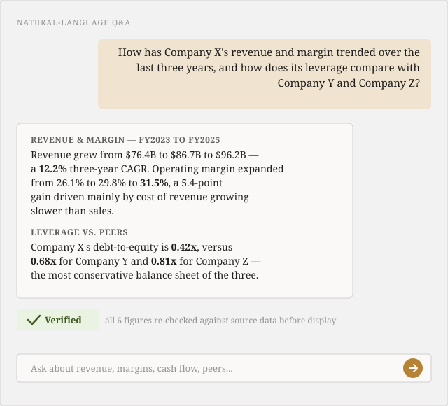
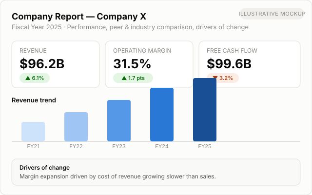
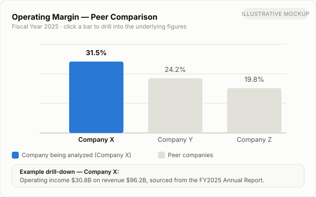
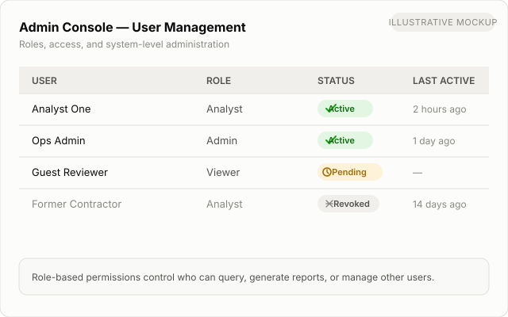

# Lectify Analytics

**Ask natural-language questions about public companies' SEC Annual and Quarterly Reports. Get answers with every number independently verified against the source data — not just plausible-sounding.**

## At a Glance

- **What it does:** ask plain-English questions about any public company's financials and get verified answers, plus automated company reports and drill-down visualizations
- **Who it's for:** finance analysts, investors, and researchers who need to move fast without trading away accuracy
- **What makes it trustworthy:** every number is independently re-checked against source data before it's shown — errors are surfaced honestly, never guessed past
- **What it saves:** analyst research time, the cost of decisions made on bad numbers, and the manual effort of after-the-fact auditing

## What this is

Financial Analytics Agent is an agentic AI system for finance analysts, investors, and researchers who need fast, trustworthy answers grounded in public companies' SEC Annual Reports and Quarterly Reports. Instead of manually digging through those reports yourself, or hoping a chatbot's summary of a PDF is accurate, you ask a question in plain English and get a grounded answer — backed by structured financial data, cross-checked before it's shown to you, and logged for auditability.

It's built for the moments where "probably right" isn't good enough: due diligence, investment research, and financial analysis workflows where a wrong number is worse than no answer.

## Why it's different

Generic AI chat tools built directly on document text retrieve a passage and let the model state whatever number appears near it — with no check that the number is actually correct, current, or attached to the right company or period. That's fine for summarization. It's not fine for financial figures a decision might depend on.

This system is built around a **verification layer** that sits between the reasoning agent and the user. Every numeric claim in a draft answer is independently re-derived from the underlying financial data and checked against what the agent said — not just re-reading the same retrieved snippet, but recomputing the figure from source. If a claim can't be verified, the system says so explicitly rather than presenting an unverified number with confidence. Every question, answer, and verification result is captured in an audit log, so results are traceable after the fact — not just a black box that produced a plausible paragraph.

In short: the reasoning happens like a chatbot, but nothing reaches the user's screen until a separate, deterministic check has confirmed it against the facts.

## Benefits & Cost Savings

- **Faster research, lower cost per question** — a question that would normally take an analyst manual time to answer (locating the right report, the right period, the right line item, then cross-checking it) is answered directly, cutting the labor cost of routine research to something close to instant.
- **Scales without proportional headcount growth** — one system can cover many companies and questions in parallel, so research coverage grows with demand instead of requiring a proportional increase in analyst headcount.
- **Lowers the cost of bad decisions** — an incorrect or unverified figure that makes it into a research note or investment memo can be expensive to catch after the fact. Independent verification is designed to catch it before it ever reaches a decision-maker.
- **Reduces manual audit and QA effort** — because every answer's reasoning and source data are logged, reviewing how an answer was reached doesn't require reconstructing it by hand, cutting the time cost of compliance and quality review.
- **Frees up premium data/research spend for higher-value work** — for many day-to-day lookups and comparisons, this substitutes for manual cross-referencing across existing data sources, so premium tools and analyst time can be reserved for judgment calls rather than routine retrieval.
- **Cloud-native cost model as it scales** — the planned cloud-native architecture (see [ROADMAP.md](ROADMAP.md)) is designed so infrastructure cost tracks actual usage rather than requiring fixed capacity paid for up front.

*[TODO: once pilot data is available, replace the qualitative claims above with measured figures — e.g. research time per question, or cost per report, before vs. after.]*

## Capabilities

- **Natural-language Q&A over SEC Annual and Quarterly Reports** — ask about revenue, margins, cash flow, debt, or trends across a company's reporting history in plain English
- **Independent verification of every numeric claim** — a dedicated verification layer checks each figure against source data before it's shown, and flags anything it can't confirm
- **Audit logging** — every question, answer, and verification outcome is recorded for traceability
- **Automated company reports** — performance over a period, peer comparison, industry comparison, insights drawn from annual report narrative, and drivers of change
- **Interactive data visualizations with drill-down** — explore a chart and drill into the underlying data points it's built from
- **Narrative grounding** — explanations of "why" a metric moved are grounded in the company's own reported disclosures, not model speculation
- **Role-based access and an admin console** — authentication, permissions, and administrative controls for managing users and system operation
- **Guardrails and observability** — safety, scope, and quality monitoring layered across the system's inputs and outputs

## See it in action

| | |
|---|---|
|  |  |
| *Ask a question, get a verified answer* | *Automated company report* |
|  |  |
| *Peer comparison with drill-down* | *Role-based admin console* |

*(Illustrative mockups, not live product screenshots, while the product UI is finalized. Click an image to view it full-size — see [docs/screenshots/](docs/screenshots/) and [docs/features.md](docs/features.md) for the full walkthrough with additional views.)*

## Tech Approach

Described at the architectural-category level (implementation specifics are intentionally omitted here — see [ARCHITECTURE.md](ARCHITECTURE.md)):

- **LLM orchestration** — an agentic reasoning layer that plans and calls tools to answer questions, rather than free-generating answers from memory
- **Deterministic verification** — a separate, non-generative check that recomputes and confirms numeric claims against source data
- **Vector / RAG retrieval** — retrieval-augmented generation over report narrative text, scoped per company, used strictly for qualitative context rather than numeric facts
- **Relational data store** — a structured store of normalized, per-company financial facts derived from SEC Annual and Quarterly Reports, used as the single source of truth for numbers
- **Guardrails framework** — input/output safety and scope checks around the reasoning layer
- **Observability / eval tooling** — logging, tracing, and evaluation of system behavior over time

## Status

This project is under active development. Core question-answering, verification, and automated report generation are functional; interactive visualization/drill-down and the role-based admin console have also landed. The system is now moving toward a cloud-native deployment architecture to support pilot deployments with early users — see [ROADMAP.md](ROADMAP.md).

The underlying codebase is currently private while the project is in active development. This repository serves as the public project profile — architecture, roadmap, and feature documentation — for evaluation purposes (including cloud partner/credits programs) ahead of a broader public or pilot release.

## Contact

Founder: Lectify

Email: info@lectify.in

Site / additional info: [TODO: fill in]

## License

See [LICENSE](LICENSE).
