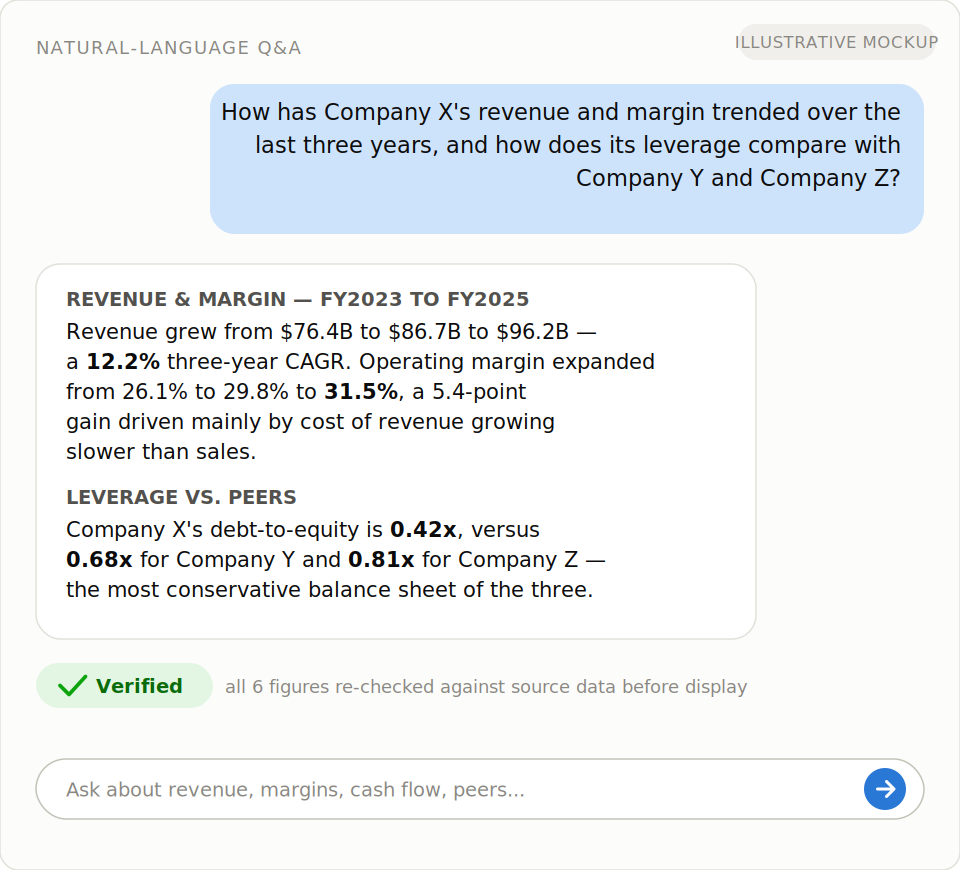
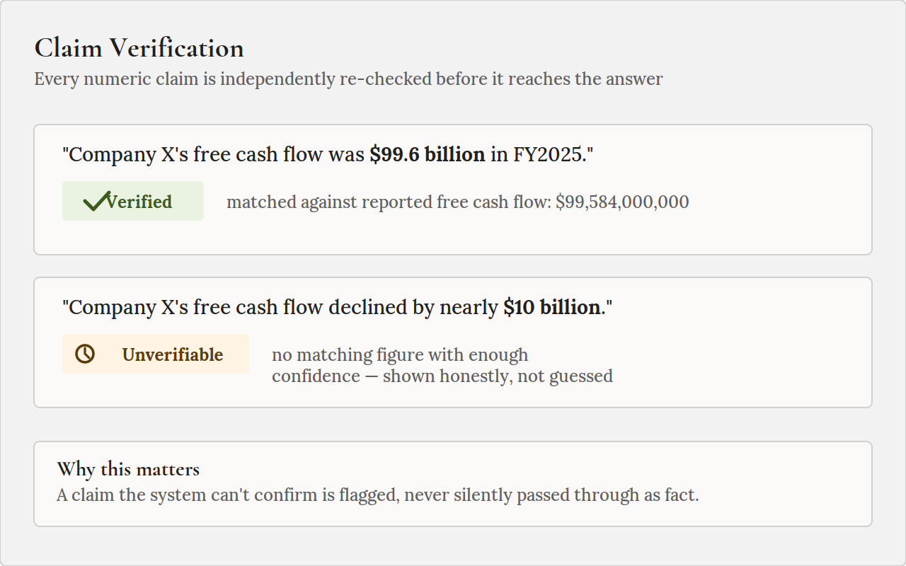
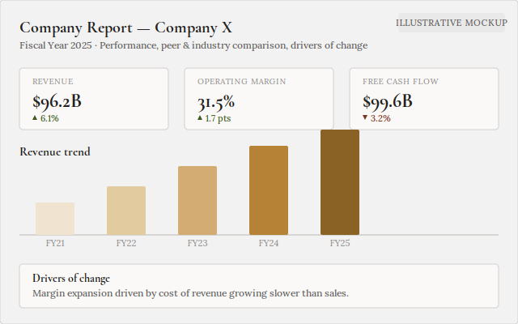
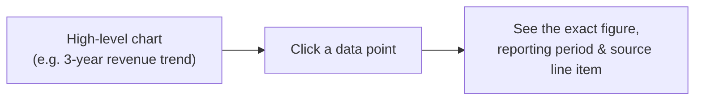
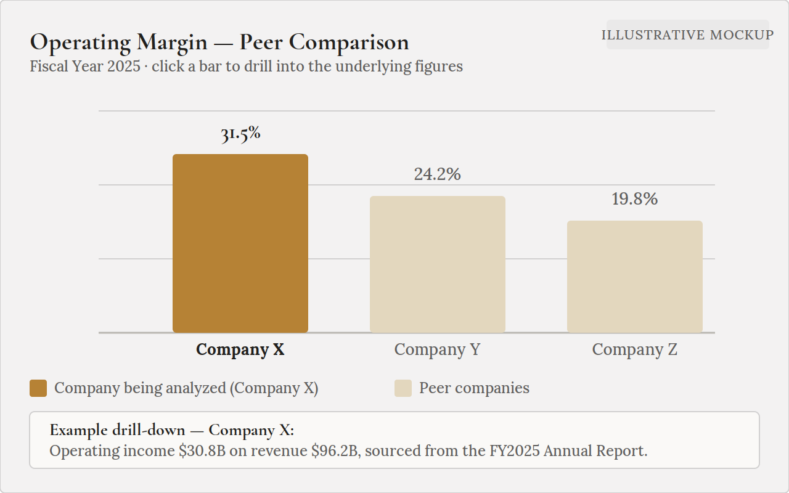
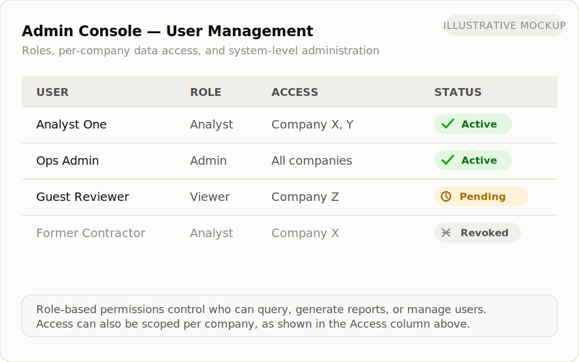
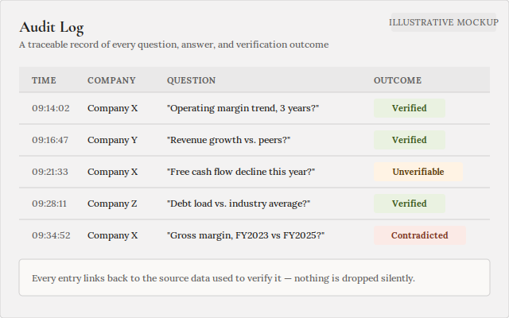

# Feature Walkthrough

A plain-language look at what you can do with Lectify Analytics today, and what you get back.

*Images below are illustrative mockups, not live product screenshots — see [screenshots/README.md](screenshots/README.md) for the shot list to swap in real captures.*

## Ask questions in plain English

Type a question the way you'd ask a colleague — no query language, no need to know where a number lives in a company's SEC Annual Report or Quarterly Report.

**You might ask:**
- "How has this company's operating margin trended over the last three years?"
- "How does this company's revenue growth compare to its closest peers?"
- "What's driving the change in free cash flow this year?"
- "Has this company's debt load gone up relative to its industry?"

**What you get back:** a direct answer in plain language, with the specific figures it's based on. Every number in the answer has been checked against the company's actual reported data before you see it — if something can't be confirmed, the answer tells you that plainly instead of stating it as fact.

*Example: asking a question and receiving a verified, plain-language answer.*

## Trust the numbers, not just the prose

Every factual, numeric claim in an answer goes through an independent check before it's shown to you. This isn't the system re-reading its own answer — it's a separate step that recomputes the figure from the underlying reported data and confirms the two agree. If they don't agree, or if there isn't enough data to check a claim, you're told so directly rather than being given a confident-sounding but unverified number.

Every question you ask and every answer you receive is logged, so results can be traced back and reviewed later — useful for due diligence, compliance, or simply double-checking how an answer was reached.

*Example: a verified figure vs. a claim the system honestly flags as unverifiable.*

## Automated company reports

Instead of asking one question at a time, generate a full report on a company covering:

- **Performance over a period** — how key metrics have moved over a chosen timeframe
- **Peer comparison** — how the company stacks up against a defined set of peer companies
- **Industry comparison** — how it compares against broader industry benchmarks
- **Insights from annual reports** — key takeaways pulled from the company's own narrative disclosures
- **Drivers of change** — plain-language explanations, grounded in the company's own reported disclosures, of why a metric moved the way it did

Reports are generated on demand and reflect the company's most recently available SEC Annual and Quarterly Report data.

*Example: an automated company report covering performance, peer comparison, and drivers of change.*

## Explore the data, not just the summary

Charts and visualizations aren't just static images — you can drill down from a high-level chart into the individual data points behind it. If a chart shows a metric trending over several years, you can dig into exactly which figures from which reports produced that trend, rather than taking the chart's shape on faith.

*Example: a peer comparison chart; clicking a point reveals the underlying figures.*

## Role-based access and administration

Not every user needs the same level of access. The system supports different user roles and permissions, along with an admin console for managing users, access, and system-level settings — so it can be used by a team, not just a single individual, with appropriate controls in place.

*Example: managing users and permissions from the admin console.*

## Guardrails and quality monitoring

Running alongside every interaction is a layer focused on keeping the system safe, on-topic, and reliable — screening for inappropriate use, keeping responses within the system's intended scope, and monitoring output quality over time so issues can be identified and addressed rather than going unnoticed.

*Example: the audit log, showing a traceable history of questions, answers, and verification outcomes.*
